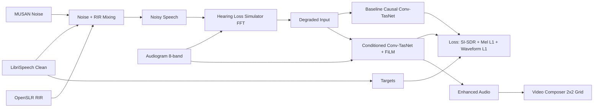

# Personalized Hearing-Aware Speech Enhancement

A production-ready repository for **Audiogram-Conditioned Video Audio Enhancement**.
It simulates hearing loss from an 8-band audiogram, trains a baseline causal Conv-TasNet and a personalized FiLM-conditioned Conv-TasNet, and generates side-by-side comparison videos.

## Motivation
People with different hearing profiles perceive identical audio very differently. This system introduces hearing-aware conditioning so enhancement can be personalized to listener-specific hearing loss.

## Architecture


## Installation
```bash
python -m venv .venv
source .venv/bin/activate
pip install -r personalized_hearing_enhancement/requirements.txt
```

## Setup Data
```bash
python -m personalized_hearing_enhancement.cli.main prepare-data --config personalized_hearing_enhancement/configs/default.yaml
```

## Training
```bash
python -m personalized_hearing_enhancement.cli.main train --model-type baseline
python -m personalized_hearing_enhancement.cli.main train --model-type conditioned
```

### Debug Mode (<5 min CPU)
```bash
python -m personalized_hearing_enhancement.cli.main debug
```
Runs tiny data subset, short training loops, demo audio generation, plots, and JSON logs.

### Overfit Single Batch
```bash
python -m personalized_hearing_enhancement.cli.main train --model-type conditioned --overfit_single_batch --run-name overfit_check
```
Produces loss curves to verify convergence and loss correctness.

## Demo Audio
```bash
python -m personalized_hearing_enhancement.cli.main demo-audio --input-wav sample.wav --audiogram "20,25,30,45,60,65,70,75" --run-name demo1
```
Outputs in `outputs/demo1/`:
- `clean.wav`
- `degraded.wav`
- `baseline.wav`
- `calibration.wav`
- `conditioned.wav`
- `output.wav` (selected with `--mode`)
- `waveforms.png`
- `spectrograms.png`
- `metrics.json`

Additional flags:
- `--mode {model,calibration}`
- `--device_profile {earbuds,headphones,airpods,overear}`
- `--max_gain_db 20`
- `--debug`

## Process Video
```bash
python -m personalized_hearing_enhancement.cli.main process-video --input sample.mp4 --audiogram "20,25,30,45,60,65,70,75" --run-name video1
```
Outputs include `comparison_grid.mp4` plus labeled audio/video variants for original, hearing-impaired, baseline, calibration-filter, and ML model output.

## Curriculum Training
Two-stage curriculum configured in `configs/default.yaml`:
- Phase 1: denoising only (no hearing-loss simulation)
- Phase 2: hearing-loss simulation + audiogram conditioning

## Sanity and Determinism
- Hearing simulator attenuation validation is run at train startup.
- Identity pre-training model check is run at startup.
- Determinism tests: `pytest personalized_hearing_enhancement/tests/test_determinism.py`

## Notebook Demo
`personalized_hearing_enhancement/notebooks/demo_walkthrough.ipynb`
- Deterministic setup
- Tiny dataset preparation
- Waveforms, spectrograms, audiogram visualization
- Baseline + conditioned inference
- Inline audio playback
- Outputs to `outputs/notebook_demo/`
