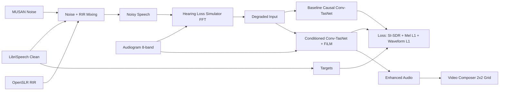

# Personalized Hearing-Aware Speech Enhancement

A production-ready repository for **Audiogram-Conditioned Video Audio Enhancement**.
It simulates hearing loss from an 8-band audiogram, trains a baseline causal Conv-TasNet and a personalized FiLM-conditioned Conv-TasNet, and generates side-by-side comparison videos.

## Motivation
People with different hearing profiles perceive identical audio very differently. This system introduces hearing-aware conditioning so enhancement can be personalized to listener-specific hearing loss.

## Architecture


## Features
- Automatic dataset download/extract/verify (LibriSpeech, MUSAN, RIRS_NOISES).
- Differentiable hearing-loss simulation via FFT-domain attenuation with smooth interpolation.
- Baseline causal Conv-TasNet and audiogram-conditioned Conv-TasNet (FiLM in each TCN block).
- Deterministic training/inference seeds set in all entry points.
- End-to-end CLI for training, demo audio, and MP4 processing.

## Installation
```bash
python -m venv .venv
source .venv/bin/activate
pip install -r personalized_hearing_enhancement/requirements.txt
```

## Setup Data
```bash
python -m personalized_hearing_enhancement.cli.main prepare-data --config personalized_hearing_enhancement/configs/default.yaml
```

## Train
```bash
python -m personalized_hearing_enhancement.cli.main train --config personalized_hearing_enhancement/configs/default.yaml --model-type baseline
python -m personalized_hearing_enhancement.cli.main train --config personalized_hearing_enhancement/configs/default.yaml --model-type conditioned
```

## Demo Audio
```bash
python -m personalized_hearing_enhancement.cli.main demo-audio --input-wav sample.wav --audiogram "20,25,30,45,60,65,70,75"
```
Outputs:
- `outputs/demo_audio/clean.wav`
- `outputs/demo_audio/degraded.wav`
- `outputs/demo_audio/baseline_enhanced.wav`
- `outputs/demo_audio/personalized_enhanced.wav`

## Process Video
```bash
python -m personalized_hearing_enhancement.cli.main process-video --input sample.mp4 --audiogram "20,25,30,45,60,65,70,75"
```
Outputs:
- Individual rendered versions with swapped audio
- `outputs/video/comparison_grid.mp4` (2x2 grid):
  1. Original
  2. Hearing-impaired
  3. Baseline-enhanced
  4. Personalized-enhanced

## Hearing Simulation
Audiogram points are interpreted at frequencies `[250, 500, 1000, 2000, 4000, 6000, 8000, 9000] Hz`. The simulator performs:
1. `rFFT(waveform)`
2. Smooth interpolation of dB attenuation over frequency bins
3. Magnitude shaping
4. `irFFT` reconstruction

This is fully differentiable and stable for training.

## FiLM Conditioning
The personalized model encodes the 8-band audiogram via a compact MLP and injects conditioning in each temporal block with FiLM (`gamma`, `beta`), enabling user-specific enhancement behavior with minimal parameter overhead.

## Perceptual Loss
Training objective:
- `0.7 * SI-SDR loss`
- `0.3 * Mel-Spectrogram L1 (80 bins)`
- `0.1 * Waveform L1`

This balances waveform fidelity and perceptual quality.

## Convenience Script
Use `./personalized_hearing_enhancement/run.sh` for common commands.
